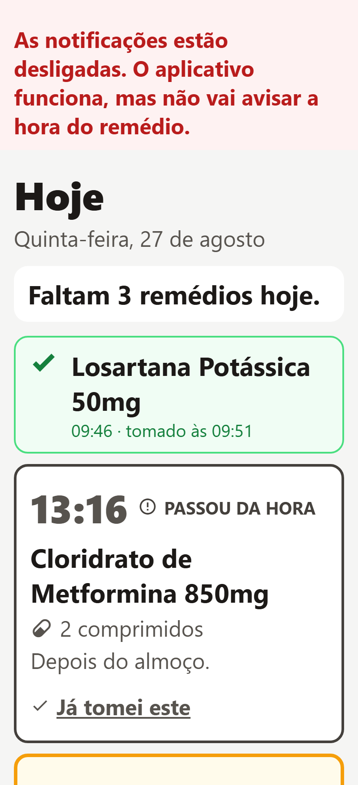

# Remédio em Dia

Aplicativo Android que lembra a hora de tomar os remédios.

Feito para uma pessoa só usar: ela abre o aplicativo para responder uma pergunta
— **já tomei?** — e mais nada. O cadastro dos remédios fica escondido atrás de um
botão discreto, porque quem cadastra faz isso uma vez por mês e quem toma faz
isso todo dia.



## O que ele faz

- **Alarme na hora certa**, como notificação do Android, com o aplicativo
  fechado e **sem internet**. O horário é agendado no relógio do próprio
  aparelho.
- **Um cartão por dose**, com o nome do remédio, quantos comprimidos e a hora.
  Só a dose que está na hora ganha botão grande — as outras ficam quietas.
- **Controle de estoque**: quantos comprimidos restam, quantos vêm na caixa, e
  um aviso quando está perto de acabar, com a conta de quantos dias ainda dá.
- **Foto da caixa**, para reconhecer o remédio pela embalagem e não pelo nome
  em letra miúda.

## Decisões que valem explicar

**Não existe servidor, conta nem senha.** Tudo mora no aparelho: os remédios em
um banco SQLite local, os alarmes agendados pelo Android. Isso é o que faz o
alarme tocar sem internet — e também significa que a lista de remédios dela não
vive em lugar nenhum além do celular dela.

**Nada de estatística de adesão.** Um aplicativo que dá nota para quem esquece
um comprimido não está ajudando.

**Nada de checagem de interação medicamentosa.** Isso é ato médico, depende de
base licenciada.

**Toque de 72px, texto grande, tema claro fixo.** O mínimo da WCAG (44px) não
basta para mão que treme. Nenhum estado é comunicado só por cor.

## Como rodar

Precisa de Node 20+ e o aplicativo **Expo Go** no celular Android.

```bash
npm install
npm start          # abre o Metro; leia o QR code com o Expo Go
```

As notificações locais funcionam no Expo Go — só o push remoto exigiria um
build próprio, e este aplicativo não usa push remoto.

Para ver as telas no navegador (útil para mexer no layout, mas **o alarme não
existe fora do Android**):

```bash
npm run web        # http://localhost:8081
```

O `metro.config.js` existe só por causa dessa visualização no navegador: ele
registra o `.wasm` do SQLite e serve os cabeçalhos COOP/COEP que o
`SharedArrayBuffer` exige.

## No celular dela, depois de instalar

Duas coisas que o Android faz por conta própria e atrapalham o alarme:

1. **Otimização de bateria** — é preciso liberar o aplicativo em
   *Configurações → Aplicativos → Remédio em Dia → Bateria → Sem restrição*.
   Samsung e Xiaomi são especialmente agressivos e matam alarmes de aplicativos
   restritos.
2. **Alarmes exatos** — no Android 12+ o aplicativo pede a permissão
   `SCHEDULE_EXACT_ALARM`. Sem ela o Android agrupa o alarme e pode atrasá-lo.

O aplicativo pede a permissão de notificação na primeira abertura. Se ela
recusar, ele continua funcionando como lista, mas avisa na tela que não vai
tocar.

## Como o código está organizado

```
src/
  dominio/    regras puras, sem React e sem banco
              doses.ts    -> os quatro estados de uma dose e os textos dela
              estoque.ts  -> a conta de quantos dias ainda dá
  dados/      banco.ts    -> esquema SQLite e migrações (PRAGMA user_version)
              remedios.ts -> cadastro, doses do dia, marcar tomada, estoque
              fotos.ts    -> câmera e galeria
  alarme/     alarme.ts      -> agenda no Android
              reconciliar.ts -> derruba tudo e reconstrói a agenda
  telas/      Hoje.tsx, MeusRemedios.tsx, FormularioRemedio.tsx
  ui/         tokens.ts e os componentes
```

A navegação é uma variável de estado no `App.tsx`, não uma biblioteca: são três
telas e um caminho só entre elas.

O alarme é reconstruído por inteiro a cada dia, nunca corrigido em partes. A
agenda vive fora do banco de dados, dentro do Android, e pode ser descartada por
uma atualização do sistema ou uma restauração de backup — reconstruir do zero é
a única operação que chega no estado certo partindo de qualquer estado anterior.

## O que ainda falta

- Botões **"JÁ TOMEI"** e **"LEMBRAR EM 15 MIN"** dentro da própria notificação,
  sem precisar abrir o aplicativo.
- Repetir o lembrete se ela não marcar em ~30 minutos.
- Gerar o APK e instalar no celular dela.

**Risco conhecido e ainda sem solução:** não existe backup. Celular quebrado ou
perdido apaga o cadastro, o histórico e o estoque.

## Nota sobre o SDK

Este projeto usa **Expo SDK 57**, que mudou bastante em relação às versões
anteriores — a API de `expo-file-system` e os gatilhos de `expo-notifications`
não são os que aparecem na maioria dos tutoriais. A referência correta é
<https://docs.expo.dev/versions/v57.0.0/>.
